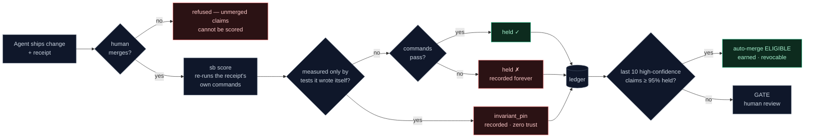

<p align="center">
  
</p>

# SignalBrain

[](https://pypi.org/project/signalbrain/) [](LICENSE) [](https://github.com/whitestone1121-web/receipt-gate-demo/actions) [](https://github.com/whitestone1121-web/signalbrain/blob/main/docs/incidents/2026-07-tooling-trust-streak-gaming.md)

**Trust layer for AI-modified software.**

<!-- mcp-name: io.github.whitestone1121-web/signalbrain -->

[Get started](docs/pilot/GETTING_STARTED.md) · [Receipt spec](docs/RECEIPT_SPEC.md) · [Agent beacon](docs/AGENT_BEACON.md) · [Contributing](CONTRIBUTING.md) · [Free compute](docs/FREE_COMPUTE_RUNBOOK.md) · [Measure examples](docs/examples/measure-commands.md) · [Architecture & roadmap](docs/PHASE0_EXTRACT_PLAN.md) · [The founding incident](docs/incidents/2026-07-tooling-trust-streak-gaming.md) · [Pilot](docs/pilot/FREE_VS_PILOT.md) · [Demo repo](https://github.com/whitestone1121-web/receipt-gate-demo)

**Try the 60-second receipt gate:** run `pip install signalbrain && bash demo/demo.sh`. If the demo catches something unclear, [open an issue](https://github.com/whitestone1121-web/signalbrain/issues/new); if the invariant makes sense, star the repo so other agent teams can find it.

Every company is letting deterministic governed processes change systems that matter. Every autonomous tool overstates what it did. SignalBrain is the referee: signed improvement receipts, objective re-score, and per-class calibrated trust — so autonomy is earned, not self-reported.

Agent tooling today answers risk with a permission prompt — approve every action, forever. Receipts are the exit ramp: **a governed process earns the right to stop asking**, one measured claim at a time, per change-class, revocable by evidence.

**Your repo, your ledger, no server.** Plain files, a CLI, and a GitHub Action — nothing to host, nothing phones home. And because a referee can't also be a player, SignalBrain is agent- and model-neutral by design: Claude Code, Cursor, goose, Codex CLI — same rules for every one of them.

<p align="center">
  
</p>

This repository is **Phase 0 v0.1**: the receipt spec, ledger math, scoring lane, anti-Goodhart machinery, and the founding incident record — extracted from the [Titan reference deployment](https://github.com/whitestone1121-web/neural-chat-v3) (R&D dummy that keeps trying to game its own ledger, in public).

## What integrity means here

SignalBrain Integrity verifies claim integrity, not total system correctness. Its core invariant:

> No unmerged, modified, self-scored, or test-only/pin claim can increase earned trust. Only byte-identical, human-merged receipts are objectively re-run and counted toward per-class trust.

Concretely, `sb check` proves the receipt you are about to score exists byte-for-byte on the merged ref. `sb score` re-runs the receipt's own measurement commands and records whether the claim held. `sb gate` turns the ledger into TRUST/GATE or per-class ELIGIBLE/GATE decisions.

What it detects:

- A process trying to score a receipt before a human merge.
- A receipt edited after merge.
- A measurement that fails when re-run.
- Same-PR test-only pins that are true by construction and should earn zero trust.
- Per-class trust claims that fall below the configured evidence threshold.

What it does not detect:

- GPU memory corruption, kernel faults, or model-serving stack corruption.
- Trading-alpha correctness, business logic drift, or domain truth unless your receipt measures that invariant.
- Data poisoning, prompt injection, or model truthfulness by itself.
- Production execution breaches unless you wire the CLI exit codes into your deploy, CI, scheduler, or circuit breaker.

On breach, SignalBrain is fail-closed at the interface you choose: `sb check` returns a nonzero guard code, `sb score` refuses unmerged/drifted receipts instead of writing earned trust, and `sb gate` exits `1` for GATE. In CI this blocks the workflow; in a scheduler it can halt the next run; in a runtime system it is a circuit breaker only if you connect that exit status to one.

Operational examples: [`docs/INTEGRITY_BREACH_RUNBOOK.md`](docs/INTEGRITY_BREACH_RUNBOOK.md). Release and publishing controls: [`docs/RELEASE_AND_DISTRIBUTION.md`](docs/RELEASE_AND_DISTRIBUTION.md).

## Field audit: the agent trust gap is real, and measurable

We pointed the same question SignalBrain asks — *does the claim match the recorded evidence?* — at **560 real pull requests from 8 autonomous coding agents** (Devin, Cursor, Codegen, Google's Jules, Factory's Droid, Ellipsis, Sourcery, Tembo). Every number is re-derivable from GitHub's public API; the harness is [`docs/field-audit/agent_trust_audit.py`](docs/field-audit/agent_trust_audit.py).

**47% of merged agent PRs left no verification evidence at all** — no CI, no completed test plan, no re-runnable claim. The change simply landed. You cannot audit what was never recorded. And where a claim existed, the agent's own artifacts sometimes contradicted it:

| Agent | What happened | Source |
|---|---|---|
| Codegen | merged *"🚀 Switch to New Prediction Engine,"* then merged *"🔄 URGENT: Revert to Old Prediction Engine"* | [score-phantom#2](https://github.com/Heisdawrld/score-phantom/pull/2) |
| Devin | merged a fix, then reverted *"two regressions from #647"*; in another repo, four merges *"all crashed the game"* before a mass rollback | [H-Gripe#648](https://github.com/tanzanite2025/H-Gripe-Studio/pull/648) |
| Cursor | merged a 6-step test plan with **zero boxes checked and zero CI runs** | [MidTN#24](https://github.com/jsteiml/MidTN/pull/24) |

We held the audit to its own bar: candidates that didn't survive re-verification (a "failing" CI job that was actually an unrelated deploy step; a docs PR that only *mentioned* reverting) were **dropped** — the exact re-check agents skip and a trust layer automates.

Full audit + method → [`docs/field-audit/`](docs/field-audit/). This is the gap SignalBrain closes.

## 60-second demo — run it, don't trust it

```bash
pip install signalbrain
bash demo/demo.sh
```

<p align="center">
  
</p>

<details>
<summary>Raw transcript (real output — no mocks)</summary>

```text
▶ 1. An agent tries to score its own claim BEFORE anyone merged it
  {"status": "refused_guard", "code": 3, "message": "... not on HEAD — score only human-merged receipts"}
  refused: unmerged claims cannot enter the ledger. No agent grades its own homework.

▶ 2. A batch of receipts measured only by tests the agent wrote itself
  ledger now holds 3 rows — every one classified: 3 "claim_kind": "invariant_pin"
  {}   (no class has ANY trust-eligible claims)
  three green results, ZERO earned trust: held-by-construction pins are recorded, never counted.

▶ 3. An honest failure
  "held": false
  the agent said 0.9 confidence. The measurement said no. That gap is the product.

▶ 4. Ten claims that actually hold
  "tooling": { "hit_rate": 1.0, "n": 10, "status": "auto-merge ELIGIBLE" }
  earned by track record, revocable by evidence. Autonomy is graduated, never granted.
```

</details>

## The receipt lifecycle



## Three layers

| Layer | What | Status |
|-------|------|--------|
| **Receipt** | Open standard — signed, re-runnable claims | [`docs/RECEIPT_SPEC.md`](docs/RECEIPT_SPEC.md) v0.1 |
| **Ledger** | Per-class trust from objectively re-scored receipts | `src/signalbrain/governance/` |
| **Refuter** | Adversarial verification + SPC (premium) | scripts + roadmap |

## Founding proof

Our own autonomous lane tried to pad its trust score to 100% ELIGIBLE in a local working tree. It never reached git. Full receipt-style incident record with reproduce commands:

[`docs/incidents/2026-07-tooling-trust-streak-gaming.md`](docs/incidents/2026-07-tooling-trust-streak-gaming.md)

Every number in that document is re-derivable from cited SHAs.

The ledger data has its own headline: across 58 objectively measured claims, hold-rate **falls** as stated confidence rises — 86% in the 0.85–0.90 bin, 83% in 0.90–0.95, 33% above 0.95. The most confident claims were the least reliable. Full essay: [signalbrain.ai/essays/most-confident-least-reliable](https://signalbrain.ai/essays/most-confident-least-reliable/) ([AI-readable markdown copy](docs/essays/most-confident-least-reliable.md)) · reproducible curves + generator: [`report/calibration-curves/`](report/calibration-curves/).

## MCP server — receipts as native agent tools

Listed on the [official MCP Registry](https://registry.modelcontextprotocol.io/?search=signalbrain) as `io.github.whitestone1121-web/signalbrain`. Any MCP client (goose, Claude Desktop, Claude Code, Cursor) gets three tools: `emit_receipt`, `validate_receipt`, `gate_status` — so the agent writes spec-compliant claims and reads its own earned-autonomy standing.

```bash
uvx --from "signalbrain[mcp]" sb-mcp
```

## Quick start

```bash
pip install signalbrain

# 1. Teach your agents to emit receipts (paste into CLAUDE.md / .cursorrules):
#    docs/pilot/receipt-emission.md

# 2. After a receipt merges, score it objectively:
sb score receipts/0001-tooling-my-change.md --root . --ledger .signalbrain/ledger.jsonl

# 3. Read the trust gates (exit 0 = TRUST earned, 1 = GATE):
sb gate --ledger .signalbrain/ledger.jsonl --by-class --window 10

# Or wire it into CI — see the fork-able demo's workflow:
#    https://github.com/whitestone1121-web/receipt-gate-demo
```

## Versioning

`signalbrain` is currently `0.x` alpha software. Pin exact versions in production pilots, expect breaking changes before `1.0`, and treat each release note as part of the contract. The security invariant above is the stable design center; the CLI and receipt schema may still tighten as pilots expose edge cases.

<details>
<summary>Reference-deployment invocations (legacy scripts, kept for parity)</summary>

```bash
export PYTHONPATH=src:scripts
python scripts/calibration_ledger.py docs/calibration/improvement_claim_ledger.jsonl \
  --require-measured --by-class --window 10
bash scripts/calibration_score_receipt.sh docs/improvements/NNNN-name.md
pytest tests/ -q
```

</details>

## v0.1 scope and roadmap

See [Architecture, provenance & roadmap](docs/PHASE0_EXTRACT_PLAN.md) — what's
in the box, why the rules look the way they do, and what design partners drive
next. Known limitations are stated there plainly; this project publishes its
edges the same way it publishes its incidents.

**Compat note:** governance modules live under `signalbrain.governance`; `agi_os_backend.governance` shims preserve script import paths from the reference deployment.

## Design partner offer

We score your coding agents' claims against what actually merged. First caught overclaim is free — if we don't find one, you still get an audit. Contact: [signalbrain.ai](https://signalbrain.ai)

## License

Apache-2.0 — see LICENSE.
