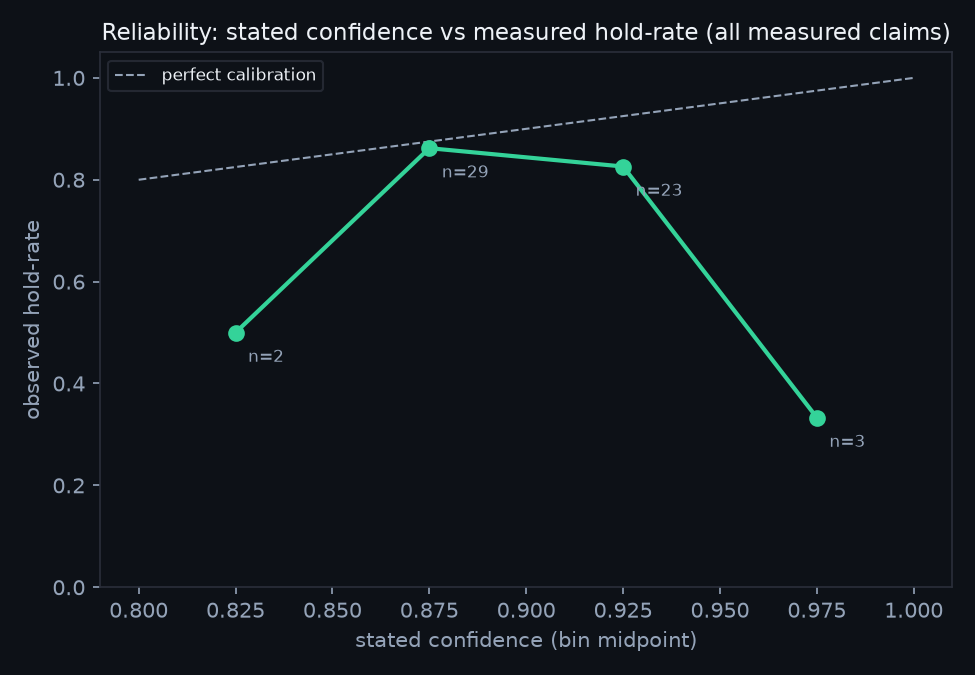

# Calibration curves — first set

The first deliverable of the "online evaluation with stakes" analysis: stated
confidence vs. objectively measured hold-rate, computed from the reference
deployment's public ledger. Generated 2026-07-04; regenerate anytime:

```bash
python report/calibration-curves/generate.py <ledger.jsonl> <receipts_dir> <out_dir>
```

## The headline finding (small n, stated up front)

**Above ~0.90 stated confidence, hold-rate falls as confidence rises.**

| Stated confidence | n | Hold-rate |
|---|---|---|
| [0.80, 0.85) | 2 | 50.0% |
| [0.85, 0.90) | 29 | **86.2%** |
| [0.90, 0.95) | 23 | **82.6%** |
| [0.95, 1.00) | 3 | **33.3%** |

The agents' *most* confident claims are their *least* reliable — the exact
overconfidence signature the trust gate exists to price. The top bin is n=3, so
treat the magnitude as anecdote; the monotonic decline from 0.875 → 0.975 is
the pattern to watch as n grows. Mechanistically it's plausible: an agent
reaches 0.95+ stated confidence precisely on the claims where it stopped
doubting itself — and doubt was doing work.



## Stratifications

- **By change-class** (`by_class.png`, data in `bins.json`): per-class curves;
  bugfix's earned ELIGIBLE standing is visible as high hold-rate in-band.
- **By difficulty proxy** (`by_difficulty.png`): measure-command count per
  receipt (1 vs 2+) — the crude first cut at the difficulty stratification
  H. Husain proposed; diff-size stratification is next.

## Method & honesty notes

- Rows: `scored_by=measured` only; invariant pins excluded — identical
  filtering to the trust gate itself.
- Difficulty proxy joins each ledger row to its receipt file and counts
  executable measure commands; rows whose receipts predate the receipt
  convention are reported as "receipt missing," not dropped silently.
- Every number in the plots is in `bins.json`; the ledger and receipts are
  public in the reference deployment's git history.
